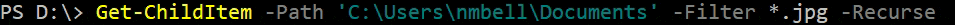

# PSExpandLine 2.0.0

[SHORT DESCRIPTION](#short-description)

[LONG DESCRIPTION](#long-description)

- [Save-AliasAsHotstring](#save-aliasashotstring)

- [Edit-CustomHotstring](#edit-customhotstring)

- [Edit-CustomHotlist](#edit-customhotlist)

[QUICK START GUIDE](#quick-start-guide)

1. [Install the module.](#1-install-the-module)

2. [Create hotstrings from native aliases.](#2-create-hotstrings-from-native-aliases)

3. [Create custom hotstrings.](#3-create-custom-hotstrings)

4. [Create custom hotlists.](#4-create-custom-hotlists)

[TRIGGERING HOTSTRING EXPANSION](#triggering-hotstring-expansion)

[DISABLING HOTSTRING EXPANSION](#disabling-hotstring-expansion)

[REPOSITIONING THE CURSOR](#repositioning-the-cursor)

[CUSTOM HOTSTRING EXAMPLES](#custom-hotstring-examples)

[ACTIVATING A HOTLIST](#activating-a-hotlist)

[INSERTING A HOTLIST ITEM](#inserting-a-hotlist-item)

[PSREADLINE DOCUMENTATION](#psreadline-documentation)

[RELEASE HISTORY](#release-history)

----------------------------------------------------------------------------------------------------
----------------------------------------------------------------------------------------------------

## SHORT DESCRIPTION
PSExpandLine is a PowerShell module that automatically expands command aliases and user-defined 'hotstrings' into full commands in the PowerShell console, and allows instant inserting and switching of items from user-defined 'hotlists'.

----------------------------------------------------------------------------------------------------
----------------------------------------------------------------------------------------------------

## LONG DESCRIPTION
PSExpandLine is a PowerShell module that automatically expands command aliases and user-defined 'hotstrings' into full commands in the PowerShell console, and allows instant inserting and switching between items from user-defined 'hotlists'.

Below is an example of a custom hotstring being expanded on the command line:


Below is an example of a hotlist being used on the command line:


Three types of hotstring are supported:
- **Native alias expansion**: expands an existing alias into its corresponding command name.
- **Simple hotstring expansion**: expands a user-defined hotstring into an arbitrary text value.
- **Dynamic hotstring expansion**: expands a user-defined hotstring into the value returned from a script block.

Two types of hotlist are supported:
- **Simple hotlist**: a fixed, user-defined list of items.
- **Dynamic hotlist**: a list of items determined by the return value of a script block.

Hotstring and hotlist definitions are stored in a set of configuration files under the module folder:
- Native alias hotstrings are stored in `.\config\PSExpandLine_native.csv`.
- Custom hotstrings are stored in `.\config\PSExpandLine_custom.csv`.
- Custom hotlists are stored in `.\config\PSExpandLine_hotlist.csv`.


### **Functions**
Three functions are provided to manage these files:

#### [Save-AliasAsHotstring](Save-AliasAsHotstring.md)
This command will create a hotstring definition from each command alias already defined in the current session. The command is designed to be run as often as necessary, such as after a new module has been loaded. The configuration file that stores the hotstrings is marked as read only. It is not intended to be edited by the user. The command will also reload the module so that the hotstrings are available immediately.

#### [Edit-CustomHotstring](Edit-CustomHotstring.md)
This command will open a list of user-defined hotstring definitions with the default editor associated with `.csv` files (on Linux machines, the file object will be written to the pipeline). If the file does not exist, the command will first create it. The command can be run as often as required by the user. The command will wait until the file has been closed, and then reload the module so that the hotstrings are available immediately. In order to see the effect of a change without closing the file, simply run `Import-Module -Name PSExpandLine -Force` in the console.

#### [Edit-CustomHotlist](Edit-CustomHotlist.md)
This command will open a list of user-defined hotlist definitions with the default editor associated with `.csv` files (on Linux machines, the file object will be written to the pipeline). If the file does not exist, the command will first create it. The command can be run as often as required by the user. The command will wait until the file has been closed, and then reload the module so that the hotlists are available immediately. In order to see the effect of a change without closing the file, simply run `Import-Module -Name PSExpandLine -Force` in the console.


### **Keyboard bindings**
The keyboard bindings for hotstrings are as follows:
```
Key                  Description
---                  -----------
Spacebar             Hotstrings: expand a defined hotstring to its value.
Shift+Spacebar       Hotstrings: suppress expansion of a defined hotstring.
```

The keyboard bindings for hotlists will depend on which hotlists have been defined, e.g.:
```
Key                  Description
---                  -----------
Ctrl+0               Hotlists: deactivate hotlists.
Ctrl+1               Hotlists: select hotlist: Sunday Monday Tuesday Wednesday Thursday Friday Saturday
Ctrl+2               Hotlists: select hotlist: January February March April May June July August September October Novemb…
Ctrl+3               Hotlists: select hotlist: C:\Users\nmbell\Contacts C:\Users\nmbell\Desktop C:\Users\nmbell\Documents…
Ctrl+4               Hotlists: select hotlist:
Ctrl+5               Hotlists: select hotlist:
Ctrl+6               Hotlists: select hotlist:
Ctrl+7               Hotlists: select hotlist:
Ctrl+8               Hotlists: select hotlist:
Ctrl+9               Hotlists: select hotlist:
Ctrl+DownArrow       Hotlists: insert the next     item in the selected hotlist.
Ctrl+UpArrow         Hotlists: insert the previous item in the selected hotlist.
Shift+Ctrl+DownArrow Hotlists: insert the next     item in the selected hotlist with double-quotes.
Shift+Ctrl+UpArrow   Hotlists: insert the previous item in the selected hotlist with double-quotes.
Shift+DownArrow      Hotlists: insert the next     item in the selected hotlist with single-quotes.
Shift+UpArrow        Hotlists: insert the previous item in the selected hotlist with single-quotes.
```

The bindings available in the current session, including a preview of list items, can be seen by running the following command:
```
Get-PSReadLineKeyHandler `
| Where-Object Function -eq PSExpandLine `
| Select-Object Key,Description `
| Sort-Object { $_.Description.Split(':')[0] },Key
```


### **Windows\Linux\Mac**
Note: Due to the way the terminal on different operating systems recognizes keyboard shortcut combinations, full hotlist functionality is only available on Windows machines. Linux and Mac users may experience reduced functionality. Visual Studio Code terminal may experience reduced functionality on all operating systems. In Windows Terminal, application key bindings take precedence, so will need to be removed to allow them to go through to the PowerShell console.

----------------------------------------------------------------------------------------------------
----------------------------------------------------------------------------------------------------

## QUICK START GUIDE
### 1. Install the module.
The [module](https://www.powershellgallery.com/packages/PSExpandLine/2.0.0) is available through the [PowerShell Gallery](https://docs.microsoft.com/en-us/powershell/scripting/gallery/getting-started). Run the following command in a PowerShell console to install the module:
```
Install-Module -Name PSExpandLine -Force
```
Run the following to import the module into the current session:
```
Import-Module -Name PSExpandLine
```

### 2. Create hotstrings from native aliases.
Simply run:
```
Save-AliasAsHotstring
```
All existing aliases will now automatically expand to their full command name, e.g. typing `gci` will automatically expand to `Get-ChildItem`.

### 3. Create custom hotstrings.
Custom hotstrings can be either simple (the hotstring is replaced with the definition text), or dynamic (the hotstring is replaced with the results of executing a script block). The definitions for both are stored in the same file. To open the file, run:
```
Edit-CustomHotstring
```
(Note: on Linux machines, rather than opening the file in its default editor, the file object will be written to the pipeline.)

The first time the command is run, the file will have only the header row:
```
"Name","Definition"
```
New simple hotstrings should be added in the same format, e.g.:
```
"ghf","Get-Help -Full -Name"
"gho","Get-Help -Online -Name"
```
Dynamic hotstrings are recognized when the first character of the definition is an opening brace `{` and the last character is a closing brace `}`. The text between the braces is executed as a PowerShell command when the hotstring is triggered, and the result is converted to string output and used to replace the hotstring, e.g.:
```
"today","{(Get-Date).DayOfWeek}"
```
To avoid unexpected behavior, ensure that the output of the definition script block for dynamic hotstrings is a scalar string value.\
Custom hotstrings that have the same name as a native alias will override the native alias hotstring.

### 4. Create custom hotlists.
Hotlists can be either simple (the list is defined in plain text), or dynamic (the list is defined by the results of executing a script block). The definitions for both are stored in the same file. Each list defines its own delimiter, however, for dynamic lists the script block is expected to return an array of strings (or objects that can be converted to strings), and so the delimiter is ignored. List items can be anything the user chooses, such as frequently used server names, URLs, file paths, or variable names. Up to nine hotlists can be defined. Each is associated to a keyboard shortcut `Ctrl+<X>`, where `<X>` is a digit from 1 to 9, that makes that list the active hotlist. `Ctrl+0` is reserved for deactivating all hotlists. In addition, one hotlist may optionally be marked as `IsDefault`, which will make that list active when the module is loaded.

To open the hotlist definitions file, run:
```
Edit-CustomHotlist
```
(Note: on Linux machines, rather than opening the file in its default editor, the file object will be written to the pipeline.)

The first time the command is run, the file will have only the header row and a set of empty definitions:
```
"Name","IsDefault","Separator","Definition"
"Ctrl+1","0","",""
"Ctrl+2","0","",""
"Ctrl+3","0","",""
"Ctrl+4","0","",""
"Ctrl+5","0","",""
"Ctrl+6","0","",""
"Ctrl+7","0","",""
"Ctrl+8","0","",""
"Ctrl+9","0","",""
```
Hotlist definitions can be added like this:
```
"Ctrl+1","0",";","Sunday;Monday;Tuesday;Wednesday;Thursday;Friday;Saturday"
"Ctrl+2","0","|","January|February|March|April|May|June|July|August|September|October|November|December"
```
Dynamic hotlists are recognized when the first character of the definition is an opening brace `{` and the last character is a closing brace `}`. The text between the braces is executed as a PowerShell command on module (re)load, and the result is converted to strings, de-duped, and used as the list of items, e.g.:
```
"Ctrl+3","0","","{ Get-ChildItem -Path $HOME -Directory }"
```
Unused lists definitions can be either removed or left undefined. The definitions can appear in any order in the file, but only those shown above will be recognized. If more than one hotlists are defined for a given keybinding, the one appearing last in the file will be used. If more than one list is marked as `IsDefault`, the one appearing last in the file will be considered the default list.

A hotlist is selected by hitting the appropriate keyboard shorcut, e.g. `Ctrl+1`. Hotlist items are inserted and cycled at the cursor position with either `Ctrl+DownArrow` or `Ctrl+UpArrow`.

----------------------------------------------------------------------------------------------------
----------------------------------------------------------------------------------------------------

## TRIGGERING HOTSTRING EXPANSION
Hotstring expansion is triggered with the `Spacebar` key. When pressed, the token immediately to the left of the cursor is examined, and if it matches a defined hotstring, the hotstring is replaced with the definition. Otherwise, a regular space is inserted at the cursor position. When an expansion is triggered and the cursor is either at the far right of the input or is not followed by a space, a space is also inserted. However, when a word is split by pressing `Spacebar`, and the characters to the left of the cursor match a hotstring, the hotstring is not expanded, because the tokens are examined before the space is inserted. In this case, moving the cursor back and simply hitting space again will trigger the expansion.

----------------------------------------------------------------------------------------------------
----------------------------------------------------------------------------------------------------

## DISABLING HOTSTRING EXPANSION
Native alias hotstrings can be disabled by creating a custom hotstring with the same name that has an empty definition, e.g.:
```
"gci",""
```
To insert a space after a defined hotstring without triggering expansion, use `Shift+SpaceBar` instead of `Spacebar`.\
Note: expansion is triggered *only* when the token to the left of the cursor is a defined hotstring. Otherwise, `Spacebar` behaves normally.

----------------------------------------------------------------------------------------------------
----------------------------------------------------------------------------------------------------

## REPOSITIONING THE CURSOR
Sometimes it is useful to be able to reposition the cursor after a hotstring has been expanded, e.g. to set it between a pair of quotation marks. When `<PSXLCursor>` is included in the definition, this text will be removed during expansion, and when the expansion is complete the cursor will be placed at its position, e.g.:
```
"ofp","Out-File -Path ""<PSXLCursor>"""
```
To avoid unexpected behavior, ensure that the definition contains, at most, one instance of `<PSXLCursor>`.

----------------------------------------------------------------------------------------------------
----------------------------------------------------------------------------------------------------

## CUSTOM HOTSTRING EXAMPLES
Below are some examples of custom hotstrings:
```
"desktoppath","{[Environment]::GetFolderPath('Desktop')}"
"desktopvar","[Environment]::GetFolderPath('Desktop')"
"sle","Select-Object -ExpandProperty"
"psco","[PSCustomObject]@{ xNamex = $xValuex }"
"dbgon","$DebugPreference = 'Continue'"
"dbgoff","$DebugPreference = 'SilentlyContinue'"
"gettodayslogs","{
	$today = (Get-Date).ToString('yyyy-MM-dd')
	$logsDir = 'C:\MyLogs'
	""Get-ChildItem -Path '$logsDir' -Recurse -Filter *.txt | Where-Object Name -like '*$today*'""
}"
```
Note: when the csv values are quoted, a literal double-quote `"` in the definition should be expressed with a double double-quote `""` in the `.csv` file.

----------------------------------------------------------------------------------------------------
----------------------------------------------------------------------------------------------------

## ACTIVATING A HOTLIST
To make a hotlist the active hotlist, simply hit the keyboard shortcut combination associated with the list, e.g. from the Quick Start Guide example, to make the list that contains the days of the week the active list, hit `Ctrl+1`. There is no visual indication that the list has been selected.

To deactive all hotlists, hit `Ctrl+0`.

----------------------------------------------------------------------------------------------------
----------------------------------------------------------------------------------------------------

## INSERTING A HOTLIST ITEM
To insert the first item from the active hotlist at the cursor position, hit `Ctrl+DownArrow`. To cycle through the list items, continue hitting `Ctrl+DownArrow` until the required item appears. To move to the previous item in the list, hit `Ctrl+UpArrow`. The position in the list is remembered, so the next time a new item is inserted, it will be the same as the last one used. To reset the list to the first item, hit the keyboard shortcut combination associated with the list.

This cycling action can be used anywhere any item from the active list appears in the current command line by positioning the cursor immediately after the last character of the item. The item's position in the list will be recognized, and the next or previous item will be inserted when the up or down selection keyboard shortcut is used. Recognition for hotlists is determined by a simple string match, rather than using a tokenized representation of the command line contents, as happens with hotstrings.

The example below illustrates the use of a hotlist to initially insert the `Path` value, and then correct it later.


Note: `gci` is expanded to `Get-ChildItem` using a native alias hotstring. The parameter names are expanded using PowerShell's native tab completion.

To insert a list item surrounded by single quotes, use `Shift+DownArrow` and `Shift+UpArrow`.

To insert a list item surrounded by double quotes, use `Ctrl+Shift+DownArrow` and `Ctrl+Shift+UpArrow`.

When a quoted list item appears in the current command line, and the cursor is positioned immediately after the closing quote (either single or double), the quotes will be recognized as part of the item and replaced with the new item.

In the example below, the single quotes are replaced with double quotes by using `Ctrl+Shift+DownArrow`.



Hotlists can be combined with hotstrings by defining a hotlist that is a list of hotstring aliases. The hotstring alias can be selected using the up or down selection keyboard shortcut, and then immediately expanded by hitting `Spacebar`. For example, with hotstrings defined as mentioned in section 3 of the Quick Start Guide above, and a hotlist defined as:
```
"Ctrl+4","0","|","ghf|gho|today"
```
The commands could be selected like this:


----------------------------------------------------------------------------------------------------
----------------------------------------------------------------------------------------------------

## PSREADLINE DOCUMENTATION
PSReadLine reference documentation can be found [here](https://docs.microsoft.com/en-us/powershell/module/psreadline/).

----------------------------------------------------------------------------------------------------
----------------------------------------------------------------------------------------------------

## RELEASE HISTORY
### 2.0.0 (2022-03-04)
- Add hotlist functionality.
- Allow hotstrings that have word-breaking non-space characters, such as `\` or `.`.
- Handle multiline hotstring expansions.
- Fix incorrect expansion when there is a space after the hotstring.
- Update module IconUri path.

### 1.1.1 (2021-12-10)
- Update setting of module path.

### 1.1.0 (2021-12-10)
- Update language and code throughout to refer to strings that will trigger an expansion as 'hotstrings'.
- Rename functions to be more descriptive; include aliases for previous names.
- Force reloading of module into Global scope to preserve appearance in Get-Module results.
- Add .INPUTS and .OUTPUTS sections in each function's help.
- Add OutputType declaration to each function.
- Update Edit-CustomHotstring to write a file object to the pipeline on Linux machines.
- Add descriptions to PSReadLine key handlers.
- Add OnRemove logic.
- Update manifest with minimum versions for PowerShell host and PSReadLine.
- Add ProjectUri, IconUri, and ReleaseNotes values to manifest.
- Add logo file for PowerShellGallery.com.
- Other minor code changes.

### 1.0.1 (2021-10-26)
- Update file path handling for cross-platform.

### 1.0.0 (2021-10-21)
- Initial release.
